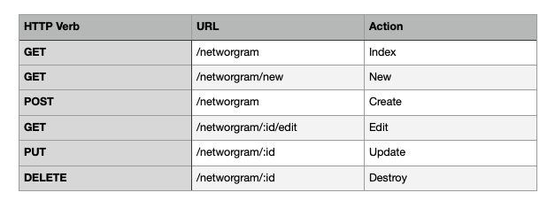
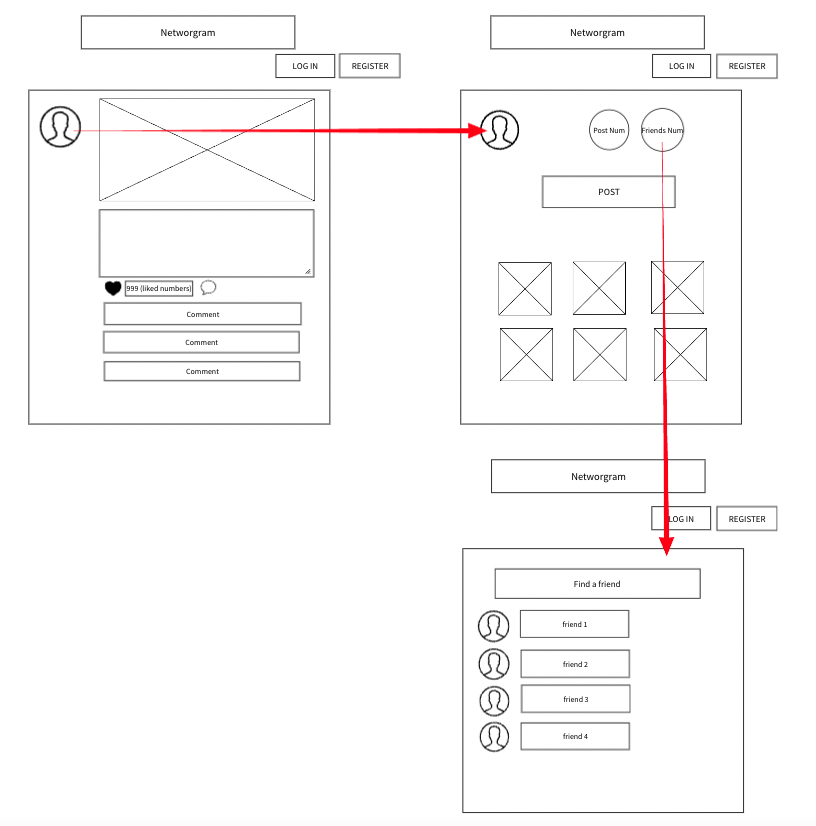

# project_3

## Project Choice (Tell us which project you're doing!)

> A name for your Project  
**Networgram**

## Project Description
> Include: 
> General App Idea/Purpose 
`Networgram` is an application focused on networking between web developers based on Instagram. 
It allows users to share their code and receive code reviews from other users. It also could be used as a worldwide debugging channel.

> Models including field names and their datatypes 
> ** ERDs for noSQL Databases 
> https://lucid.app/lucidchart/4070bec0-ea3b-4534-b0d5-8e4dc0e7f58a/edit?docId=4070bec0-ea3b-4534-b0d5-8e4dc0e7f58a&shared=true&page=0_0&invitationId=inv_7e0da9ac-7f12-4e6e-81c6-54e7936bb242#
> 
** Routes

## Wireframes
> Wireframes with basic page layouts 
> Copy and paste or drag and drop your images here.

## User Stories
> User stories detailing app functionality 
> As a networgram user:
I can share on my wall the code I committed to Github, the problems solved or unsolved in Leetcode, and check the code reviews from other users. Similarly, you can see other users' codes and help them out. Also, you could meet someone who refers you to their company, so you can build a great network betwwen developers.

### MVP Goals
* to be able to post, edit, delete a post
* to be able to see how many people liked my post
* to be able to see the other user's comments on my post
* to be able to click a 'like-button' on the other user's post
* to be able to leave a comment on the other user's post

### Stretch Goals
* to be able to Log in and Register
* to be able to post an image
* to be able to find and add a friend 

